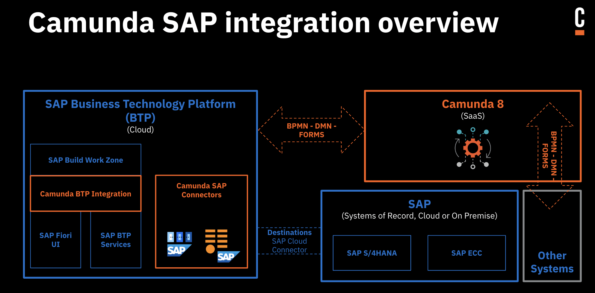

Camunda's SAP integration consists of several features that can be used independently of one another: SAP OData, RFC, and BTP.

- [SAP OData Connector](./odata-connector.md): Interact with a S/4HANA or ECC System via OData v2 + v4 APIs, directly from your BPMN model.
- [SAP RFC outbound Connector](./rfc-connector.md): Query BAPIs and remote-enabled function modules on SAP ECC systems.
- [SAP BTP integration](./btp-integration.md)
  - Use [Tasklist's](/components/tasklist/introduction-to-tasklist.md) forms in the Fiori UI
  - Operate SAP BTP services from [BPMN tasks](/components/modeler/bpmn/bpmn.md)
  - Inbound proxy endpoint to start process instances of BPMN models, including custom variables

These features run in the customer's [SAP BTP instance](https://www.sap.com/products/technology-platform.html). They do not require a proprietary Camunda setup, and instead re-use an existing infrastructure with minimal prerequisites.

