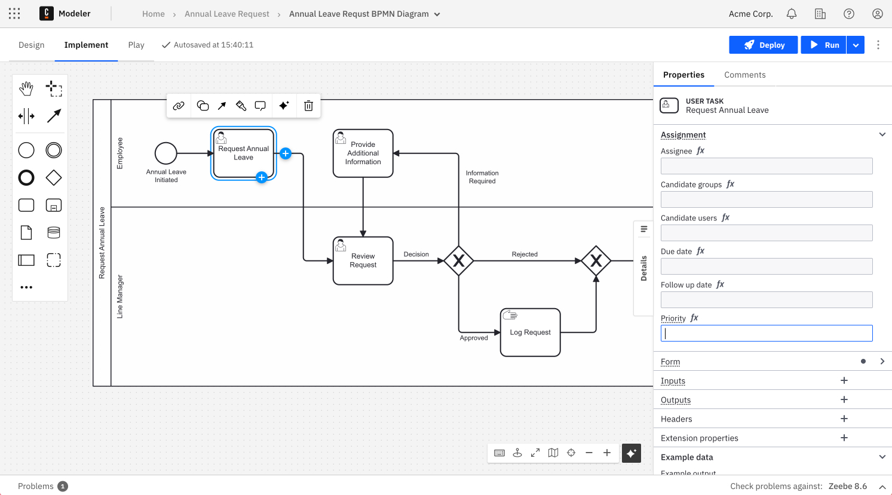
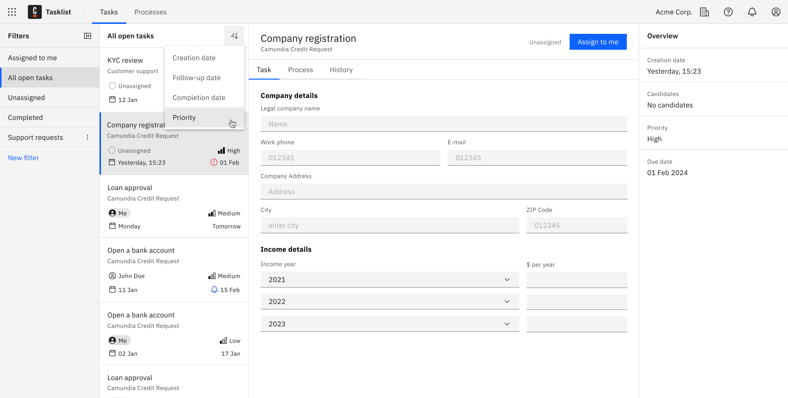

import styles from "./styles.module.css";

You can add prioritization to [User Task elements](/components/modeler/bpmn/user-tasks/user-tasks.md) by specifying a priority value for a user task. This determines the task's importance in relation to other tasks within processes.

- The task priority is an **integer** value ranging from 0 to 100, with a default value of 50.
- A higher priority value indicates higher importance.

When displayed in Tasklist, priority values are mapped to the following default labels:

| Priority value | Default label |
| :------------- | :------------ |
| 0-25           | Low           |
| 26-50          | Medium        |
| 51-75          | High          |
| 76-100         | Critical      |

These labels give Tasklist users a clear view of task priority, making it easier to assess a task's urgency. This also makes sorting and filtering simple, helping users prioritize the most important tasks.

## Step-by-step guide

This step-by-step guide shows you how to define task priorities for Tasklist users.

### 1. Model a BPMN process

Start by modeling your [BPMN process in Modeler](/guides/automating-a-process-using-bpmn.md), ensuring that the required user tasks are defined within the process.

### 2. Set a priority for user tasks

During user task configuration you can specify a priority value. You can also define the value using an [expression](/components/concepts/expressions.md).

The priority value determines the task's importance relative to other tasks.

### 3. Deploy and start the process

After the process is fully defined and all configurations are complete, the process can be deployed and started. The priority values are now associated with each user task within the process.

### 4. View task priority in Tasklist

Tasklist users can view the tasks assigned to them within their task list. Each task card displays the assigned priority label, ensuring users have a clear understanding of the task's importance and priority.

### 5. Sort tasks by priority

Task users can sort tasks by priority. This helps users organize their workload by focusing on urgent items first.

